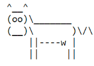
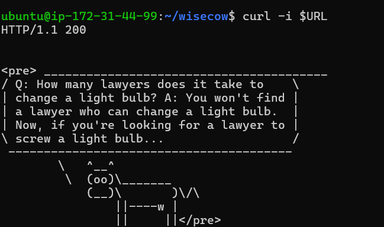
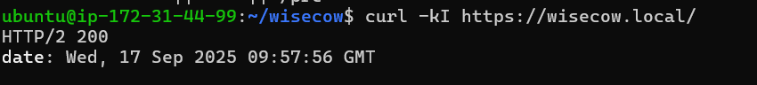

# Wisecow DevOps Assessment

A complete containerization and deployment solution for the Wisecow application with automated CI/CD pipeline and TLS security.

---

## Table of Contents
- [About](#about)
- [Features](#features)
- [Prerequisites](#prerequisites)
- [Quick Start](#quick-start)
- [Kubernetes Deployment](#kubernetes-deployment)
- [CI/CD Pipeline](#cicd-pipeline)
- [TLS/HTTPS Support](#tlshttps-support)
- [Verification Results](#verification-results)
- [Scripts for Monitoring](#scripts-for-monitoring)
- [License](#license)

---

## About

Wisecow is a lightweight web server that displays inspirational cow wisdom using `fortune` and `cowsay` commands. This project demonstrates complete DevOps practices including containerization, Kubernetes deployment, automated CI/CD, and secure HTTPS communication.

---

## Features

- **Containerized Application**: Dockerized Wisecow web server
- **Kubernetes Ready**: Complete K8s manifests for deployment, service, and ingress
- **Automated CI/CD**: GitHub Actions workflow for build and push
- **TLS Security**: HTTPS support with self-signed certificates
- **Health Monitoring**: System and application monitoring scripts
- **Production Ready**: Namespace isolation and proper resource management

---

## Prerequisites

- Docker installed
- Kubernetes cluster (Minikube recommended for local development)
- kubectl CLI configured
- GitHub account with Docker Hub credentials

---

## Quick Start

### 1. Local Development
git clone https://github.com/bhushanmahajan0070/wisecow-devops.git
cd wisecow-devops

Build and run locally
docker build -t wisecow-app:latest .
docker run -p 3000:3000 wisecow-app:latest

Test the application
curl http://localhost:3000

### 2. Kubernetes Deployment
Start Minikube cluster
minikube start

Deploy to Kubernetes
kubectl apply -f k8s/

Check deployment status
kubectl get pods -n wisecow -w

Test the service
URL=$(minikube service wisecow-service -n wisecow --url)
curl -i $URL

### 3. Enable HTTPS/TLS
Enable Ingress controller
minikube addons enable ingress

Create TLS secret
kubectl create secret tls wisecow-tls
--key tls.key --cert tls.crt
-n wisecow --dry-run=client -o yaml | kubectl apply -f -

Apply Ingress
kubectl apply -f k8s/ingress.yaml -n wisecow

Map hostname and test HTTPS
echo "$(minikube ip) wisecow.local" | sudo tee -a /etc/hosts
curl -kI https://wisecow.local/

---

## CI/CD Pipeline

The GitHub Actions workflow (`.github/workflows/ci-cd.yml`) automatically:

1. **Builds** Docker image on every push to main
2. **Pushes** to Docker Hub with latest tag  
3. **Enables** continuous deployment to Kubernetes

### Required GitHub Secrets:
- `DOCKERHUB_USERNAME`: Your Docker Hub username
- `DOCKERHUB_TOKEN`: Docker Hub access token

---

## TLS/HTTPS Support

Secure HTTPS communication is implemented using:
- Self-signed TLS certificates (tls.crt, tls.key)
- Kubernetes TLS secret for certificate storage
- Nginx Ingress Controller for TLS termination
- Custom domain mapping (wisecow.local)

---

## Verification Results

### Service Test (HTTP via NodePort)

**Command used:**
URL=$(minikube service wisecow-service -n wisecow --url)
curl -i $URL
**Result:** HTTP/1.1 200 OK with full Wisecow application response

### HTTPS Test (TLS via Ingress)  

**Command used:**
curl -kI https://wisecow.local/

**Result:** HTTP/2 200 OK confirming secure TLS connection

---

## Scripts for Monitoring

The `scripts/` directory contains monitoring utilities:

### System Health Monitor
bash scripts/health_check.sh
Monitors CPU, memory, disk usage and logs alerts when thresholds are exceeded.

### Application Uptime Checker  
python3 scripts/app_uptime_check.py https://wisecow.local

Performs HTTP health checks and reports application availability.

---

## Project Structure
wisecow-devops/
├── Dockerfile # Container build instructions
├── wisecow.sh # Main application script
├── k8s/ # Kubernetes manifests
│ ├── namespace.yaml
│ ├── deployment.yaml
│ ├── service.yaml
│ └── ingress.yaml
├── .github/workflows/ # CI/CD pipeline
│ └── ci-cd.yml
├── scripts/ # Monitoring scripts
│ ├── health_check.sh
│ └── app_uptime_check.py
├── docs/ # Documentation and proof
│ ├── service-200.png
│ └── https-200.png
├── tls.crt # TLS certificate
├── tls.key # TLS private key
└── README.md # This file

---

## License

This project is licensed under the Apache License 2.0 - see the [LICENSE](LICENSE) file for details.

---

## Credits

Thanks to [@nyrahul](https://github.com/nyrahul) for the original Wisecow application.

---

## Contact

For questions or support, please open an issue or contact [mahajanbhushan2005@gmail.com](mailto:mahajanbhushan2005@gmail.com).

